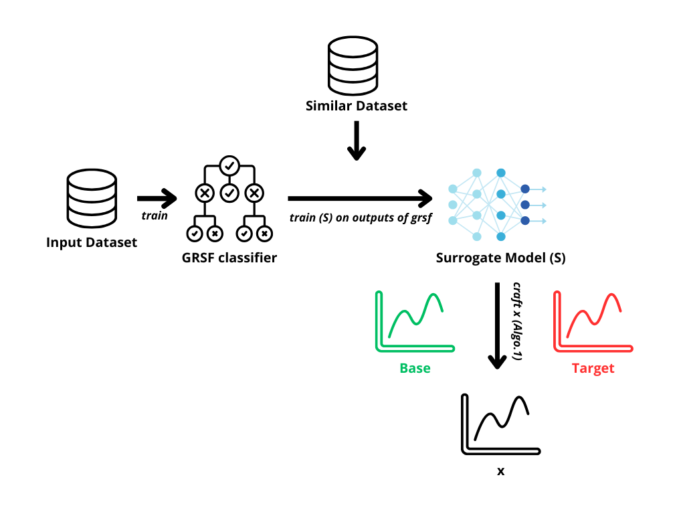

## GRSF counterfactual generation

# Gabin Vrillault

## Project description

This project was developed as part of my second-year engineering internship at DSV Stockholm University. It aims to generate counterfactuals for the GRSF model, which is a model that uses a forest of shapelets to classify time series data. My implementation focuses on generating counterfactuals using gradient based methods. 

## Algorithm explanation

The goal of the algorithm is to generate counterfactuals for a given time series dataset. The classifier that we want to explain is the GRSF model and it is not gradient based. Therefore, we use a surrogate model that we train on the outputs of the GRSF model on a given dataset. The surrogate model is now a gradient based model that imitates the behavior of the GRSF model. We then use this surrogate model to generate counterfactuals. For this we need a base and a target instance from different classes.
Then we use the following algorithm to generate counterfactuals:
(from arXiv:1804.00792)

$$
\begin{aligned}
&\text { Algorithm } 1 \text { Counterfactual Example Generation }\\
&\text { Input: target instance } t \text {, base instance } b \text {, learning rate } \lambda\\
&\text { Initialize x: } x_0 \leftarrow b\\
&\text { Define: } L_p(x)=\|f(\mathbf{x})-f(\mathbf{t})\|^2\\
&\text { for } i=1 \text { to maxIters do }\\
&\text { Forward step: } \widehat{x_i}=x_{i-1}-\lambda \nabla_x L_p\left(x_{i-1}\right)\\
&\text { Backward step: } x_i=\left(\widehat{x_i}+\lambda \beta b\right) /(1+\beta \lambda)\\
&\text { end for }
\end{aligned}
$$

Illustration:

