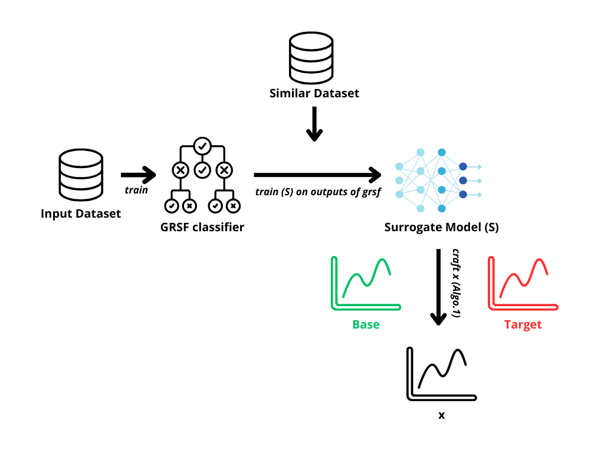

# GRSF Counterfactual Generation

[](https://www.python.org/downloads/)
[](https://streamlit.io/)
[](https://pytorch.org/)
[](LICENSE)
[](Dockerfile)

A gradient-based counterfactual generation tool for time series classifiers. This project uses surrogate neural networks to generate counterfactual explanations for the non-differentiable Random Shapelet Forest (GRSF) classifier.

> Developed as part of a research internship at DSV, Stockholm University.

## How it works

The GRSF classifier is not gradient-based, so we train a **surrogate neural network** that imitates its behavior. We then use gradient-based optimization on the surrogate to generate counterfactuals — minimal modifications to a time series that change the classifier's prediction.

The core algorithm (from [arXiv:1804.00792](https://arxiv.org/abs/1804.00792)) iteratively applies forward and backward gradient steps:

$$
\begin{aligned}
&\text{Algorithm 1: Counterfactual Example Generation}\\
&\text{Input: target instance } t \text{, base instance } b \text{, learning rate } \lambda\\
&\text{Initialize x: } x_0 \leftarrow b\\
&\text{Define: } L_p(x)=\|f(\mathbf{x})-f(\mathbf{t})\|^2\\
&\text{for } i=1 \text{ to maxIters do}\\
&\quad\text{Forward step: } \widehat{x_i}=x_{i-1}-\lambda \nabla_x L_p\left(x_{i-1}\right)\\
&\quad\text{Backward step: } x_i=\left(\widehat{x_i}+\lambda \beta b\right) /(1+\beta \lambda)\\
&\text{end for}
\end{aligned}
$$



## Features

- **Interactive Streamlit UI** for the entire pipeline: dataset selection, model training, and counterfactual generation
- **Multiple surrogate architectures**: Feedforward, LSTM, CNN, and Transformer classifiers
- **Local counterfactuals**: Select specific time series regions to modify via interactive plots
- **Batch generation**: Generate and analyze multiple counterfactuals at once
- **Experiment logging**: Save and compare experiment results across configurations
- **Analysis dashboard**: Distance metrics (Euclidean, DTW), sparsity, validity checks, and PAA analysis

## Getting started

### Prerequisites

- Python 3.13+
- pip

### Local installation

```bash
git clone https://github.com/your-username/grsf-counterfactual-generation.git
cd grsf-counterfactual-generation
python -m venv .venv
source .venv/bin/activate  # On Windows: .venv\Scripts\activate
pip install -r requirements.txt
streamlit run ui/main.py
```

### Docker

```bash
docker compose up --build
# Open http://localhost:8501
```

## Project structure

```
grsf-counterfactual-generation/
├── gen.py                # Core counterfactual generation algorithm
├── counterfactual.py     # Batch generation and distance analysis
├── models.py             # Surrogate classifier architectures (LSTM, CNN, Transformer)
├── ui/
│   ├── main.py           # Streamlit entry point
│   ├── pages/            # UI pages (generation, experiments)
│   ├── components/       # Reusable UI components
│   └── model/            # Data models and experiment logging
├── paper.pdf             # Research paper describing the method
├── requirements.txt
├── Dockerfile
└── docker-compose.yml
```

## Paper

The research paper describing this method is available at [`paper.pdf`](paper.pdf).

## License

This project is licensed under the MIT License. See [LICENSE](LICENSE) for details.

## Author

**Gabin Vrillault** — ENSICAEN / DSV Stockholm University
